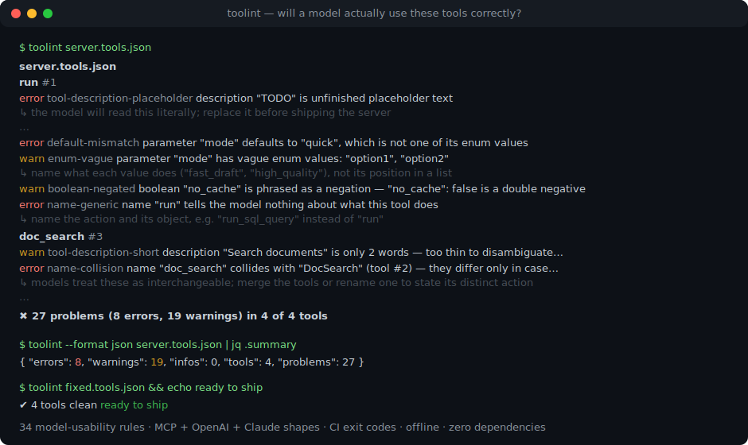
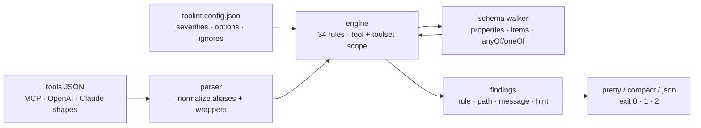

# toolint

[English](README.md) | [中文](README.zh.md) | [日本語](README.ja.md)

[](LICENSE)   [](CONTRIBUTING.md)

**MCP ツールの JSON Schema を検査するオープンソースの linter — 説明の欠落、曖昧な enum、モデルを混乱させる命名を 34 のルールで検出する。JSON Schema として完全に妥当なスキーマでも、それを読むすべてのモデルにツールを誤用させることはあり得るからだ。**



```bash
# not yet on npm — install from a checkout of this repository
npm install && npm run build && npm pack
npm install -g ./toolint-0.1.0.tgz
```

## なぜ toolint？

モデルがツールを誤用するとき——ツールの選択ミス、引数のでっち上げ、enum の当てずっぽう——原因はたいていモデルではなくツールのスキーマにある。しかし既存のツールチェーンにはそれを捕まえる仕組みがない。`ajv` の類が調べるのはスキーマが*構造的に妥当*かどうかで、`{"name": "run", "inputSchema": {"type": "object"}}` は満点で通過する。MCP Inspector はカタログを表示するだけで何も評価しない。Spectral のような汎用 API linter が知っているのは OpenAPI の慣習であって、*言語モデル*が正しいツールを選び引数を正しく埋めるための条件ではない。toolint が埋めるのはまさにこの欠けた層だ。公開されているツール作成ガイダンスから蒸留した 34 のルール——動詞で始まる命名、大文字小文字違いの衝突を許さない、名前の復唱ではなく*いつ*呼ぶかを語る説明、意味を持つ enum 値（`option1` ではなく `fast_draft`）、自身のスキーマを満たすデフォルト値、否定形 boolean の禁止、自由形式オブジェクトの禁止。カタログ全体を一度に lint し（ツール間の名前衝突や説明の重複こそモデルが最も苦しむ場所だ）、ツール定義が流通するあらゆる形——MCP `tools/list` レスポンス、裸の配列、OpenAI `parameters` / Claude `input_schema` ラッパー——を読み取り、すべての指摘に具体的な修正ヒントと CI 向けの終了コードを添える。

|  | toolint | ajv（バリデータ） | MCP Inspector | Spectral |
|---|---|---|---|---|
| 妥当性だけでなくモデル可用性を評価 | 34 のヒューリスティック | いいえ——妥当性のみ | いいえ——表示のみ | OpenAPI 向けスタイル規則 |
| ツール横断チェック（名前衝突・説明重複） | あり、カタログ全体 | なし | なし | なし |
| MCP / OpenAI / Claude のツール形式を理解 | すべて正規化して対応 | スキーマ非依存 | MCP のみ | OpenAPI/AsyncAPI |
| すべての指摘に実行可能な修正ヒント | あり | エラーポインタ | 該当なし | ルールごとの一文 |
| 終了コード + JSON レポートで CI 実行 | 0 / 1 / 2 + `--format json` | ライブラリとして | いいえ——対話 UI | あり |
| ランタイム依存 | ゼロ | 4 パッケージ | 数十（Web アプリ） | 数十 |

<sub>ajv 8、公式 MCP Inspector、Spectral 6 との比較。各公開ドキュメントと lockfile に基づく（2026-07）。いずれも別の問題を解く良いツールであり、モデル可用性の評価を試みるものは一つもない。</sub>

## 特徴

- **JSON Schema の重箱の隅ではなく、34 のモデル可用性ルール** — 命名（7）、説明（8）、スキーマ形状（12）、enum（7）。それぞれが文書化された LLM ツール呼び出しの失敗モードに対応し、各ルールの根拠は [docs/rules.md](docs/rules.md) にある。
- **カタログ全体の分析** — `DocSearch` と `doc_search` の衝突、`file_delete` と `delete_file` の近似重複、ツール間で同一の説明をツールセット単位で検出する。単一スキーマのバリデータには見えない層だ。
- **すべての指摘が直し方を教える** — メッセージは何が壊れモデルがなぜつまずくかを述べ、ヒントは代わりに何を書くべきかを示す（`"no_cache": false は二重否定 → boolean は肯定形で命名`）。
- **手元にあるものをそのまま読む** — MCP `tools/list` 結果（生の JSON-RPC 含む）、裸のツール配列、単一ツール、OpenAI `{"type": "function"}` ラッパー、`parameters` / `input_schema` エイリアスを一つのモデルに正規化する。
- **CI のために作られた** — バイト単位で決定的な出力、終了コード 0/1/2、`--format json|compact`、`--quiet`、`--max-warnings 0`、そして厳格に検証される `toolint.config.json`：ルール id の打ち間違いはハードエラーで、静かに素通りしない。
- **ランタイム依存ゼロ** — 必要なのは Node.js だけ。`typescript` が唯一の devDependency で、エンジン全体を型付きライブラリとして import できる（`lintTools`、`parseToolsJson`、ルールレジストリ）。

## クイックスタート

インストール：

```bash
# not yet on npm — install from a checkout of this repository
npm install && npm run build && npm pack
npm install -g ./toolint-0.1.0.tgz
```

同梱の問題だらけのサンプルを lint する（実際のキャプチャ出力、抜粋）：

```bash
toolint examples/messy-server.tools.json
```

```text
examples/messy-server.tools.json
  run #1
    error  tool-description-placeholder  description "TODO" is unfinished placeholder text
                                         ↳ the model will read this literally; replace it before shipping the server
    warn   free-form-object              parameter "data" is a free-form object — the model has to invent its keys
                                         ↳ enumerate the expected keys under "properties", or use a typed "additionalProperties" schema for maps
    warn   param-description-missing     parameter "data" has no description
                                         ↳ say what goes in it, the expected format, and a concrete example value
    ...
✖ 27 problems (8 errors, 19 warnings) in 4 of 4 tools
```

稼働中サーバーの `tools/list` レスポンスをそのまま lint する、あるいはビルドをゲートする：

```bash
echo '{"jsonrpc":"2.0","id":1,"result":{"tools":[{"name":"run"}]}}' | toolint --stdin
toolint --max-warnings 0 my-server.tools.json   # exit 1 on any warning
```

```text
<stdin>
  run #1
    error  tool-description-missing  tool has no description — the model can only guess when to call it
                                     ↳ state what the tool does, when to use it, and what it returns, in one to three sentences
    error  schema-missing            tool has no inputSchema — clients and models cannot know what arguments it takes
                                     ↳ declare an object schema; a tool without parameters is {"type": "object", "properties": {}}
    error  name-generic              name "run" tells the model nothing about what this tool does
                                     ↳ name the action and its object, e.g. "run_sql_query" instead of "run"

✖ 3 problems (3 errors, 0 warnings) in 1 of 1 tool
```

対になるクリーンなサンプルは `✔ 5 tools clean` の終了コード 0 で通る——どちらのカタログも [examples/](examples/README.md) にある。

## ルール

カテゴリは 4 つ。`toolint --rules` が同じ一覧をターミナルに表示し、[docs/rules.md](docs/rules.md) が各ルールのモデル可用性上の根拠を説明する。

| カテゴリ | ルール数 | 代表的なチェック |
|---|---|---|
| naming | 7 | 汎用的な名前（`run`、`tool1`）、動詞で始まらない名前、大小文字の衝突（`DocSearch`/`doc_search`）、語順違いの近似重複 |
| description | 8 | 欠落/TODO/短すぎる説明、名前を復唱するだけの説明、ツール間の重複、説明のないパラメータ |
| schema | 12 | 自由形式オブジェクト、`required` の幽霊エントリ、自身の enum を外れたデフォルト値、否定形 boolean、深すぎるネスト、union の過積載 |
| enum | 7 | `option1` 式のスロット名、`pdf`/`PDF` のコイントス、文字列と数値の混在、空 enum と巨大 enum |

重大度はルールごとに設定でき（`off`/`info`/`warn`/`error`）、数値しきい値（`too-many-params.max`、`deep-nesting.max` など）はルールのオプション——[設定](docs/rules.md#configuration)を参照。

## `toolint` CLI

| フラグ | 既定値 | 効果 |
|---|---|---|
| `<file...>` / `--stdin` | — | JSON ファイル群、または stdin から 1 ドキュメントを lint |
| `--format <name>` | `pretty` | `pretty`（グループ化 + ヒント）、`compact`（grep 向きの 1 行形式）、`json`（機械可読） |
| `--config <file>` / `--no-config` | 最寄りの `toolint.config.json` | 設定を明示指定、または自動探索をスキップ |
| `--quiet` | オフ | error のみ報告 |
| `--max-warnings <n>` | 無制限 | 警告が `n` を超えたら終了コード 1 |
| `--no-color` | 自動 | ANSI カラーを無効化（着色は TTY のみ。`NO_COLOR` にも従う） |
| `--rules` | — | 34 ルールのリファレンスを表示して終了 |

終了コード：**0** クリーン（警告は許容）、**1** error 級の指摘あり、または `--max-warnings` 超過、**2** 入力が読めない・JSON の形が不明・設定が不正。

## アーキテクチャ



## ロードマップ

- [x] naming/description/schema/enum にわたる 34 ルール、カタログ全体の分析、MCP + OpenAI + Claude の入力形式、厳格検証つき設定、3 種類の出力形式、修正ヒント、フル CLI（v0.1.0）
- [ ] 機械的に直せるケースの `--fix`（大小文字の正規化、単一値 enum の `const` 化）
- [ ] ルールパック：オプトインの strict プロファイルと、ガイダンスの進化に合わせたクライアント別プロファイル
- [ ] tools だけでなく MCP の prompts と resources の lint
- [ ] コードレビュー注釈用の SARIF 出力
- [ ] npm への公開

全リストは [open issues](https://github.com/JaydenCJ/toolint/issues) を参照。

## コントリビュート

コントリビュート歓迎。`npm install && npm run build` でビルドし、`npm test`（91 テスト）と `bash scripts/smoke.sh`（`SMOKE OK` の出力が必須）を実行する——このリポジトリは CI を持たず、上記の主張はすべてローカル実行で検証されている。[CONTRIBUTING.md](CONTRIBUTING.md) を読み、[good first issue](https://github.com/JaydenCJ/toolint/issues?q=is%3Aissue+is%3Aopen+label%3A%22good+first+issue%22) を掴むか、[discussion](https://github.com/JaydenCJ/toolint/discussions) を始めてほしい。

## ライセンス

[MIT](LICENSE)
