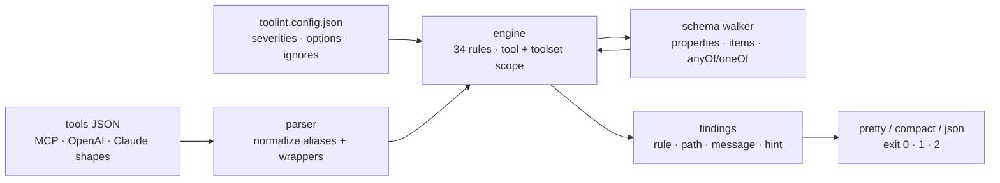

# toolint

[English](README.md) | [中文](README.zh.md) | [日本語](README.ja.md)

[](LICENSE)   [](CONTRIBUTING.md)

**An open-source linter for MCP tool JSON Schemas — 34 rules that flag missing descriptions, vague enums, and model-confusing names, because a schema can be perfectly valid JSON Schema and still make every model that reads it call your tool wrong.**


```bash
# not yet on npm — install from a checkout of this repository
npm install && npm run build && npm pack
npm install -g ./toolint-0.1.0.tgz
```

## Why toolint?

When a model misuses a tool — wrong tool picked, arguments invented, enums guessed — the bug is usually in the tool's schema, not the model. But nothing in the existing toolchain catches it: `ajv` and friends check whether a schema is *structurally valid*, which `{"name": "run", "inputSchema": {"type": "object"}}` passes with flying colors; the MCP Inspector shows you your catalog but judges nothing; and generic API linters like Spectral know OpenAPI conventions, not what makes a *language model* pick the right tool and fill in its arguments correctly. toolint encodes exactly that missing layer: 34 rules distilled from published tool-authoring guidance — verb-first names, no case-colliding near-duplicates, descriptions that say *when* to call a tool rather than restating its name, enums whose values mean something (`fast_draft`, not `option1`), defaults that satisfy their own schema, no negated booleans, no free-form objects. It lints whole catalogs at once (cross-tool collisions and duplicate descriptions are where models suffer most), reads every shape a tool definition travels in — MCP `tools/list` responses, bare arrays, OpenAI `parameters` / Claude `input_schema` wrappers — and ships every finding with a concrete fix hint and a CI-ready exit code.

|  | toolint | ajv (validation) | MCP Inspector | Spectral |
|---|---|---|---|---|
| Judges model usability, not just validity | 34 heuristic rules | no — validity only | no — display only | style rules for OpenAPI |
| Cross-tool checks (collisions, duplicate descriptions) | yes, whole catalog | no | no | no |
| Understands MCP / OpenAI / Claude tool shapes | all of them, normalized | schema-agnostic | MCP only | OpenAPI/AsyncAPI |
| Actionable fix hint on every finding | yes | error pointers | n/a | message per rule |
| Runs in CI with exit codes + JSON report | 0 / 1 / 2 + `--format json` | as a library | no — interactive UI | yes |
| Runtime dependencies | zero | 4 packages | dozens (web app) | dozens |

<sub>Comparison with ajv 8, the official MCP Inspector, and Spectral 6 per their public docs and lockfiles, 2026-07. They are good tools solving different problems — none of them tries to judge model usability.</sub>

## Features

- **34 model-usability rules, not JSON-Schema pedantry** — naming (7), descriptions (8), schema shape (12), and enums (7), each encoding a documented failure mode of LLM tool calling; the full rationale per rule lives in [docs/rules.md](docs/rules.md).
- **Whole-catalog analysis** — `DocSearch` vs `doc_search` collisions, `file_delete` vs `delete_file` near-duplicates, and identical descriptions across tools are caught at the toolset level, where single-schema validators cannot look.
- **Every finding teaches the fix** — messages state what breaks and why models trip on it; hints say what to write instead (`"no_cache": false is a double negative → phrase booleans positively`).
- **Reads what you already have** — MCP `tools/list` results (raw JSON-RPC included), bare tool arrays, single tools, OpenAI `{"type": "function"}` wrappers, and `parameters` / `input_schema` aliases all normalize to one model.
- **Built for CI** — deterministic byte-identical output, exit codes 0/1/2, `--format json|compact`, `--quiet`, `--max-warnings 0`, and a strictly-validated `toolint.config.json` where a typo'd rule id is a hard error, not a silent no-op.
- **Zero runtime dependencies** — Node.js is the only requirement; `typescript` is the sole devDependency, and the whole engine is importable as a typed library (`lintTools`, `parseToolsJson`, the rule registry).

## Quickstart

Install:

```bash
# not yet on npm — install from a checkout of this repository
npm install && npm run build && npm pack
npm install -g ./toolint-0.1.0.tgz
```

Lint the bundled messy example (real captured output, truncated):

```bash
toolint examples/messy-server.tools.json
```

```text
examples/messy-server.tools.json
  run #1
    error  tool-description-placeholder  description "TODO" is unfinished placeholder text
                                         ↳ the model will read this literally; replace it before shipping the server
    warn   free-form-object              parameter "data" is a free-form object — the model has to invent its keys
                                         ↳ enumerate the expected keys under "properties", or use a typed "additionalProperties" schema for maps
    warn   param-description-missing     parameter "data" has no description
                                         ↳ say what goes in it, the expected format, and a concrete example value
    ...
✖ 27 problems (8 errors, 19 warnings) in 4 of 4 tools
```

Lint a live server's catalog straight from its `tools/list` response, or gate a build:

```bash
echo '{"jsonrpc":"2.0","id":1,"result":{"tools":[{"name":"run"}]}}' | toolint --stdin
toolint --max-warnings 0 my-server.tools.json   # exit 1 on any warning
```

```text
<stdin>
  run #1
    error  tool-description-missing  tool has no description — the model can only guess when to call it
                                     ↳ state what the tool does, when to use it, and what it returns, in one to three sentences
    error  schema-missing            tool has no inputSchema — clients and models cannot know what arguments it takes
                                     ↳ declare an object schema; a tool without parameters is {"type": "object", "properties": {}}
    error  name-generic              name "run" tells the model nothing about what this tool does
                                     ↳ name the action and its object, e.g. "run_sql_query" instead of "run"

✖ 3 problems (3 errors, 0 warnings) in 1 of 1 tool
```

The clean counterpart exits 0 with `✔ 5 tools clean` — both catalogs live in [examples/](examples/README.md).

## Rules

Four categories; `toolint --rules` prints the same list in the terminal, and [docs/rules.md](docs/rules.md) explains the model-usability rationale behind each rule.

| Category | Rules | Flagship checks |
|---|---|---|
| naming | 7 | generic filler (`run`, `tool1`), non-verb-first names, case-collisions (`DocSearch`/`doc_search`), reordered near-duplicates |
| description | 8 | missing/TODO/too-short descriptions, descriptions that just restate the name, duplicates across tools, undocumented parameters |
| schema | 12 | free-form objects, phantom `required` entries, defaults outside their own enum, negated booleans, deep nesting, union overload |
| enum | 7 | `option1`-style slot names, `pdf`/`PDF` coin-flips, string/number mixes, empty and oversized enums |

Severities are configurable per rule (`off`/`info`/`warn`/`error`), and numeric thresholds (`too-many-params.max`, `deep-nesting.max`, ...) are options — see [Configuration](docs/rules.md#configuration).

## The `toolint` CLI

| Flag | Default | Effect |
|---|---|---|
| `<file...>` / `--stdin` | — | lint JSON files, or one document from stdin |
| `--format <name>` | `pretty` | `pretty` (grouped, hints), `compact` (grep-friendly lines), `json` (machine-readable) |
| `--config <file>` / `--no-config` | nearest `toolint.config.json` | pick a config explicitly, or skip discovery |
| `--quiet` | off | report errors only |
| `--max-warnings <n>` | unlimited | exit 1 when more than `n` warnings remain |
| `--no-color` | auto | disable ANSI colors (used only on a TTY; `NO_COLOR` is honored too) |
| `--rules` | — | print the 34-rule reference and exit |

Exit codes: **0** clean (warnings allowed), **1** error findings or `--max-warnings` exceeded, **2** unreadable input, unrecognized JSON shape, or invalid config.

## Architecture



## Roadmap

- [x] 34 rules across naming/description/schema/enum, whole-catalog analysis, MCP + OpenAI + Claude input shapes, config with strict validation, three output formats, fix hints, and the full CLI (v0.1.0)
- [ ] `--fix` for the mechanical cases (case normalization, `const` for single-value enums)
- [ ] Rule packs: opt-in strict profile and per-client profiles as guidance evolves
- [ ] Lint MCP prompts and resources, not just tools
- [ ] SARIF output for code-review annotations
- [ ] Publish to npm

See the [open issues](https://github.com/JaydenCJ/toolint/issues) for the full list.

## Contributing

Contributions are welcome. Build with `npm install && npm run build`, then run `npm test` (91 tests) and `bash scripts/smoke.sh` (must print `SMOKE OK`) — this repository ships no CI, every claim above is verified by local runs. See [CONTRIBUTING.md](CONTRIBUTING.md), grab a [good first issue](https://github.com/JaydenCJ/toolint/issues?q=is%3Aissue+is%3Aopen+label%3A%22good+first+issue%22), or start a [discussion](https://github.com/JaydenCJ/toolint/discussions).

## License

[MIT](LICENSE)
