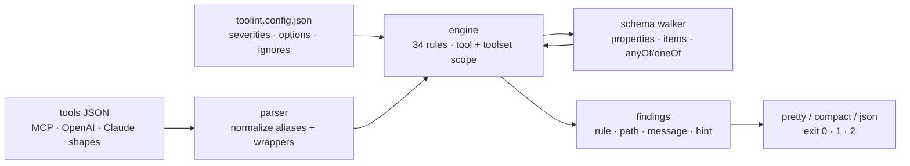

# toolint

[English](README.md) | [中文](README.zh.md) | [日本語](README.ja.md)

[](LICENSE)   [](CONTRIBUTING.md)

**开源的 MCP 工具 JSON Schema linter —— 34 条规则，专抓缺失的描述、含糊的枚举和让模型犯迷糊的命名。一个 schema 完全可以是合法的 JSON Schema，却让每个读到它的模型都把你的工具用错。**


```bash
# not yet on npm — install from a checkout of this repository
npm install && npm run build && npm pack
npm install -g ./toolint-0.1.0.tgz
```

## 为什么是 toolint？

当模型用错工具——选错工具、编造参数、瞎猜枚举——问题通常出在工具的 schema 上，而不是模型。但现有工具链里没有任何环节能抓住它：`ajv` 之流检查的是 schema 是否*结构合法*，`{"name": "run", "inputSchema": {"type": "object"}}` 可以满分通过；MCP Inspector 只把目录展示给你看，不做任何评判；Spectral 这类通用 API linter 懂的是 OpenAPI 惯例，而不是什么才能让*语言模型*选对工具、填对参数。toolint 补上的正是这缺失的一层：34 条规则，提炼自公开的工具编写指南——动词开头的命名、不允许大小写互撞的近似重名、描述要说明*何时*调用而非复述名字、枚举值要有含义（`fast_draft` 而不是 `option1`）、默认值必须满足自己的 schema、不要否定式布尔、不要自由形态对象。它一次 lint 整个目录（跨工具的重名与重复描述正是模型最受折磨的地方），能读取工具定义流转时的所有形态——MCP `tools/list` 响应、裸数组、OpenAI `parameters` / Claude `input_schema` 包装——并给每条发现附上具体的修复提示和 CI 友好的退出码。

|  | toolint | ajv（校验器） | MCP Inspector | Spectral |
|---|---|---|---|---|
| 评判模型可用性，而不只是合法性 | 34 条启发式规则 | 否——只管合法性 | 否——只做展示 | OpenAPI 风格规则 |
| 跨工具检查（重名、重复描述） | 是，整个目录 | 否 | 否 | 否 |
| 理解 MCP / OpenAI / Claude 工具形态 | 全部归一化支持 | 与 schema 无关 | 仅 MCP | OpenAPI/AsyncAPI |
| 每条发现附可操作的修复提示 | 是 | 错误指针 | 不适用 | 每条规则一句消息 |
| 以退出码 + JSON 报告跑在 CI 里 | 0 / 1 / 2 + `--format json` | 作为库使用 | 否——交互式 UI | 是 |
| 运行时依赖 | 零 | 4 个包 | 数十个（Web 应用） | 数十个 |

<sub>与 ajv 8、官方 MCP Inspector、Spectral 6 的对比，依据其公开文档与 lockfile，2026-07。它们都是解决其他问题的好工具——只是没有一个尝试评判模型可用性。</sub>

## 特性

- **34 条模型可用性规则，而非 JSON Schema 咬文嚼字** —— 命名（7）、描述（8）、schema 形态（12）、枚举（7），每条都对应一种有据可查的 LLM 工具调用失败模式；每条规则的完整依据见 [docs/rules.md](docs/rules.md)。
- **整目录分析** —— `DocSearch` 与 `doc_search` 的碰撞、`file_delete` 与 `delete_file` 的近似重名、跨工具的相同描述，都在工具集层面被抓住——单 schema 校验器根本看不到这一层。
- **每条发现都教你怎么修** —— 消息说明坏在哪里、模型为何被绊倒；提示告诉你应该写成什么（`"no_cache": false 是双重否定 → 布尔参数用肯定式命名`）。
- **直接读你手头已有的东西** —— MCP `tools/list` 结果（含原始 JSON-RPC）、裸工具数组、单个工具、OpenAI `{"type": "function"}` 包装、`parameters` / `input_schema` 别名，全部归一到同一个模型。
- **为 CI 而生** —— 输出确定到字节、退出码 0/1/2、`--format json|compact`、`--quiet`、`--max-warnings 0`，以及严格校验的 `toolint.config.json`：规则 id 打错是硬错误，绝不静默放过。
- **零运行时依赖** —— 只需要 Node.js；`typescript` 是唯一的 devDependency，整个引擎可作为带类型的库导入（`lintTools`、`parseToolsJson`、规则注册表）。

## 快速上手

安装：

```bash
# not yet on npm — install from a checkout of this repository
npm install && npm run build && npm pack
npm install -g ./toolint-0.1.0.tgz
```

lint 内置的问题示例（真实捕获输出，有截断）：

```bash
toolint examples/messy-server.tools.json
```

```text
examples/messy-server.tools.json
  run #1
    error  tool-description-placeholder  description "TODO" is unfinished placeholder text
                                         ↳ the model will read this literally; replace it before shipping the server
    warn   free-form-object              parameter "data" is a free-form object — the model has to invent its keys
                                         ↳ enumerate the expected keys under "properties", or use a typed "additionalProperties" schema for maps
    warn   param-description-missing     parameter "data" has no description
                                         ↳ say what goes in it, the expected format, and a concrete example value
    ...
✖ 27 problems (8 errors, 19 warnings) in 4 of 4 tools
```

直接从 `tools/list` 响应 lint 线上服务器的目录，或者卡住一次构建：

```bash
echo '{"jsonrpc":"2.0","id":1,"result":{"tools":[{"name":"run"}]}}' | toolint --stdin
toolint --max-warnings 0 my-server.tools.json   # exit 1 on any warning
```

```text
<stdin>
  run #1
    error  tool-description-missing  tool has no description — the model can only guess when to call it
                                     ↳ state what the tool does, when to use it, and what it returns, in one to three sentences
    error  schema-missing            tool has no inputSchema — clients and models cannot know what arguments it takes
                                     ↳ declare an object schema; a tool without parameters is {"type": "object", "properties": {}}
    error  name-generic              name "run" tells the model nothing about what this tool does
                                     ↳ name the action and its object, e.g. "run_sql_query" instead of "run"

✖ 3 problems (3 errors, 0 warnings) in 1 of 1 tool
```

与之相对的干净示例以 `✔ 5 tools clean` 退出码 0 通过——两份目录都在 [examples/](examples/README.md)。

## 规则

四个类别；`toolint --rules` 在终端打印同一份清单，[docs/rules.md](docs/rules.md) 解释每条规则背后的模型可用性依据。

| 类别 | 规则数 | 代表性检查 |
|---|---|---|
| naming | 7 | 万金油命名（`run`、`tool1`）、非动词开头、大小写碰撞（`DocSearch`/`doc_search`）、词序颠倒的近似重名 |
| description | 8 | 缺失/TODO/过短的描述、只是复述名字的描述、跨工具重复、无文档的参数 |
| schema | 12 | 自由形态对象、`required` 里的幽灵条目、越出自身枚举的默认值、否定式布尔、过深嵌套、union 过载 |
| enum | 7 | `option1` 式占位值、`pdf`/`PDF` 抛硬币、字符串数字混用、空枚举与超大枚举 |

每条规则的严重级别可配置（`off`/`info`/`warn`/`error`），数值阈值（`too-many-params.max`、`deep-nesting.max` 等）是规则选项——见[配置](docs/rules.md#configuration)。

## `toolint` 命令行

| 参数 | 默认值 | 效果 |
|---|---|---|
| `<file...>` / `--stdin` | — | lint 若干 JSON 文件，或从 stdin 读一份文档 |
| `--format <name>` | `pretty` | `pretty`（分组 + 提示）、`compact`（适合 grep 的单行）、`json`（机器可读） |
| `--config <file>` / `--no-config` | 最近的 `toolint.config.json` | 显式指定配置，或跳过自动发现 |
| `--quiet` | 关 | 只报告 error 级别 |
| `--max-warnings <n>` | 不限 | 警告数超过 `n` 时以 1 退出 |
| `--no-color` | 自动 | 关闭 ANSI 颜色（仅在 TTY 上着色；同样遵守 `NO_COLOR`） |
| `--rules` | — | 打印 34 条规则的参考清单后退出 |

退出码：**0** 干净（允许警告），**1** 存在 error 级发现或超出 `--max-warnings`，**2** 输入不可读、JSON 形态不识别或配置非法。

## 架构



## 路线图

- [x] 覆盖 naming/description/schema/enum 的 34 条规则、整目录分析、MCP + OpenAI + Claude 输入形态、严格校验的配置、三种输出格式、修复提示与完整 CLI（v0.1.0）
- [ ] `--fix` 处理机械可修的场景（大小写归一化、单值枚举改 `const`）
- [ ] 规则包：可选的 strict 档位，以及随指南演进的按客户端档位
- [ ] lint MCP 的 prompts 与 resources，不止 tools
- [ ] SARIF 输出，用于代码评审批注
- [ ] 发布到 npm

完整列表见 [open issues](https://github.com/JaydenCJ/toolint/issues)。

## 贡献

欢迎贡献。先 `npm install && npm run build` 构建，再跑 `npm test`（91 个测试）和 `bash scripts/smoke.sh`（必须打印 `SMOKE OK`）——本仓库不带 CI，上面的每一条主张都由本地运行验证。参见 [CONTRIBUTING.md](CONTRIBUTING.md)，认领一个 [good first issue](https://github.com/JaydenCJ/toolint/issues?q=is%3Aissue+is%3Aopen+label%3A%22good+first+issue%22)，或发起一个 [discussion](https://github.com/JaydenCJ/toolint/discussions)。

## 许可证

[MIT](LICENSE)
